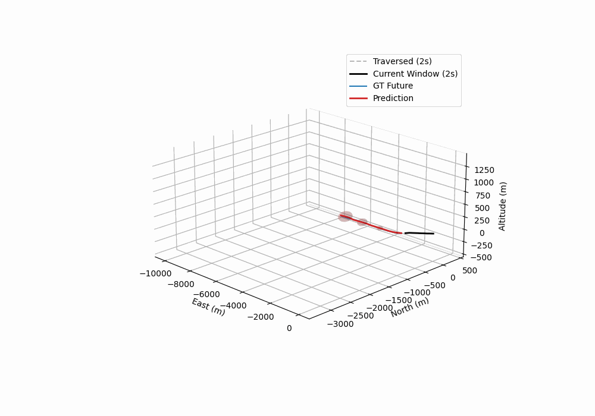
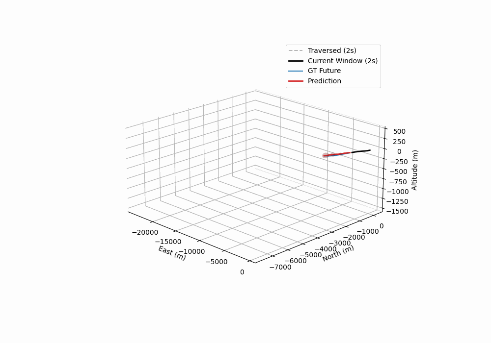

# ITSC-prediction
# Project Name: Trajectory Prediction

To further illustrate the multi-horizon prediction and uncertainty propagation described in our work, here are the animated demonstrations:

## 1. Ascending Phase (Climbing)

## 2. Descending Phase (Landing)

